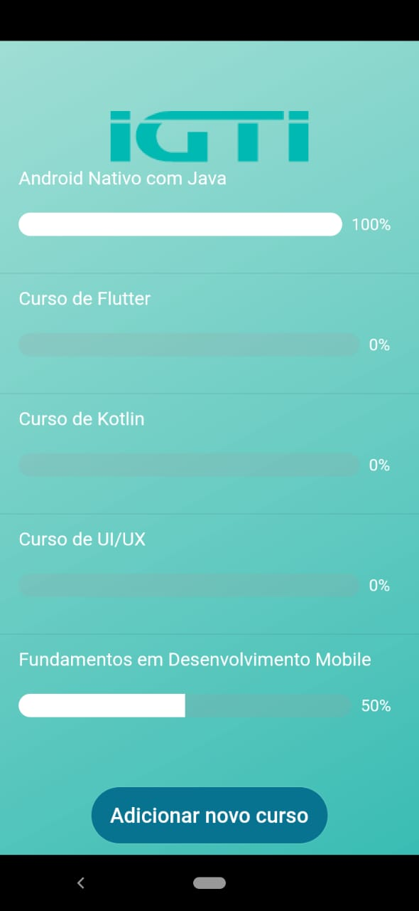
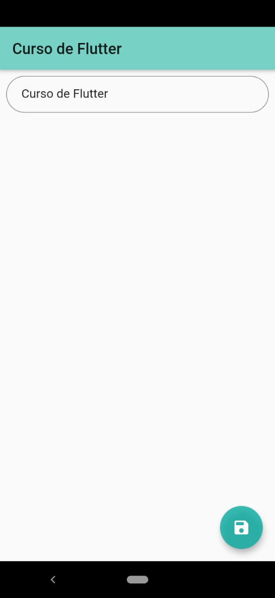

# IGTI - GraphQL

Projeto contendo utilização de GraphQL para listagem de cursos e máterias.

Esse projeto contempla a atividade da máteria de Fundamentos em Desenvolvimento Mobile do IGTI.

## Aplicativo

    
    

## Technologies
* [Flutter](https://flutter.dev)
* [Slidy](https://github.com/Flutterando/slidy)
* [Hasura](https://hasura.io/)

### Main Packages
* Flutter Modular
* Mobx
* Dio
* GraphQL
